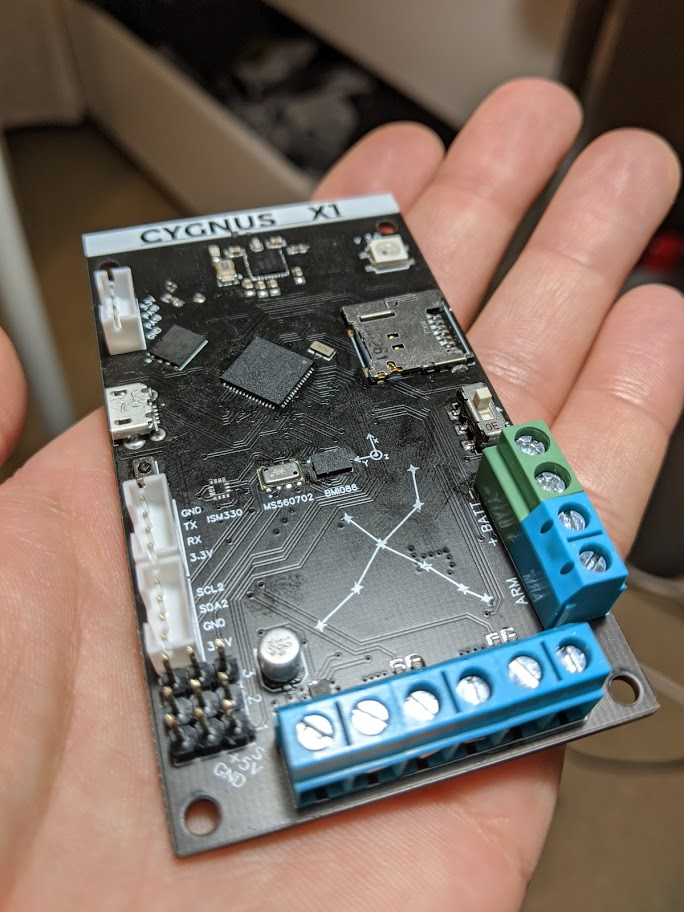
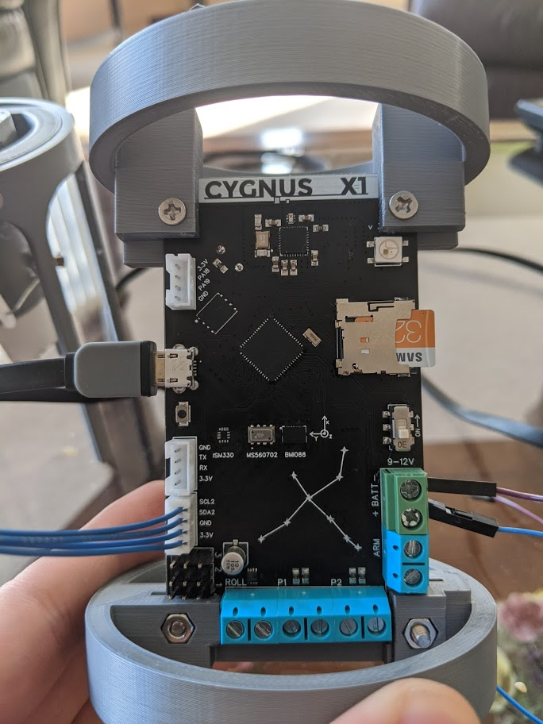
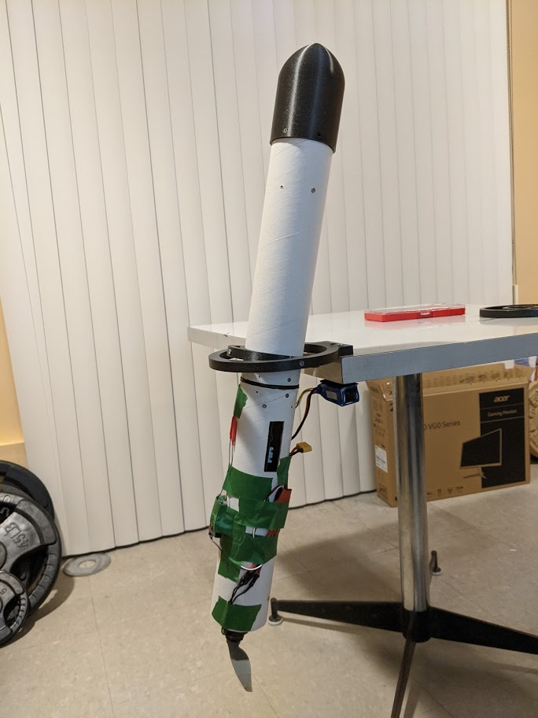

# CygnusX1

#Say hello to Cygnus X1.

## A thrust-vectoring model rocket flight computer. Comes with all you need to keep your rocket pointing up.

### [Click to see thrust vectoring video](https://photos.app.goo.gl/tZUskvHCKAZkRQRq5)

It's fully compatible with the Arduino IDE, Platformio etc. Code is written in C++.

### It's got a bunch of features that are sure to satisfy any model rocket enthusiast:

- Based on the SAMD51 microcontroller running at 120 MHz with 1MB of flash. (ATSAMD51J20A-MUT)
- Bluetooth Low Energy (BLE) controllable. Send and receive data between the rocket and your phone.
- 3 Servo Channels ( Use two for thrust-vectoring and one for other stuff like a mechanical parachute ejection system!)
- 2 Pyro Channels capable of ingiting motor ignitors and nichrome wire. Fully PWM controllable for variable current control.
- 1 DC Motor driver for those times you need roll control with a reaction wheel.
- Runs on 2S and 3S LIPO batteries. 3S preferable (11.1 V)
- Includes an arming terminal to keep you safe from misfiring pyro channels.
- Six axis IMU (BOSCH BMI088) and Altimeter (MS560702)
- SD Card port so you can save your data!
- 16MB of external flash storage. Save data during flight (SD card connections can be sporadic during flight due to vibrations)
- RGB Neopixel LED and Buzzer
- Extra UART and I2C Connections in case you want to hook up external sensors like a GPS module!

## Schematic preview

The board was designed using EasyEDA and fabricated using JLCPCB.

Board files and schematic can be found in this repo.
Schematic PDF is provided in the repo in case this photo is too small.
